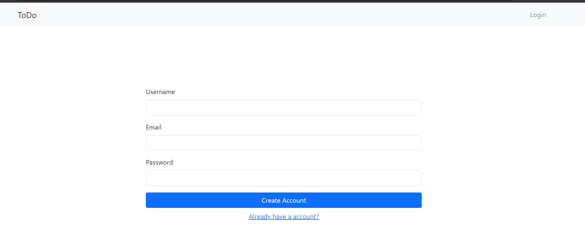
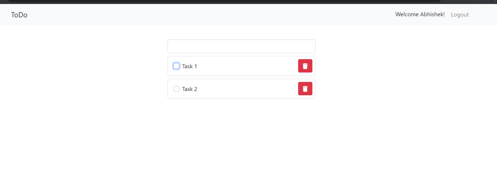
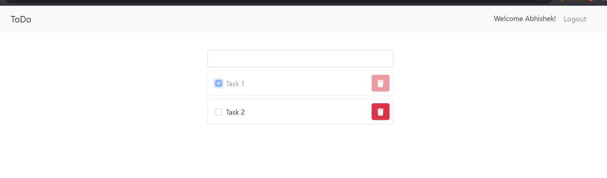

Full stack app for Tasks.

Create or Login account to add tasks.

Add Tasks

Mark task as done when it gets completed

How to run:

    1. Clone to local machine
    2. install node modules and dependencies by running react scripts
    3. Start Django server by running python manage.py runserver
    4. Start React server by running npm start